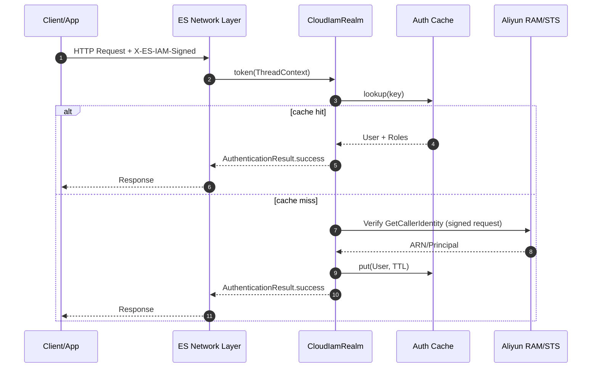

# Elasticsearch 自研 IAM 桥接设计文档 (ES-Identity-Bridge v0)

## Problem Statement
为 Elasticsearch 提供 Aliyun RAM 用户/角色认证入口，允许以 RAM 体系控制 ES 内置用户与角色，不依赖用户名/密码，同时保证性能、安全、稳定性无退化。

## Background & Assumptions
- ES 支持通过 `SecurityExtension` 注入自定义 Realm。
- Aliyun RAM/STS 支持可验证签名请求（如 GetCallerIdentity）。
- 集群具备外网或专线出站访问 IAM 的能力。
- 客户端可生成 RAM/STS 规范签名或完整已签名请求。

## Goals
- 提供 `cloud_iam` Realm，支持 RAM 用户到 ES 角色映射（v1 仅 RAM User，Assumed Role 预留开关）。
- 认证延迟可控（缓存命中 p99 < 5ms；未命中 p99 < 200ms，依赖 IAM）。
- 默认 fail closed；具备可观测性、可回滚性与抗流量突刺能力。

## Must-Fix Requirements (安全与稳定性硬性项)
- **请求绑定策略必须明确且可实现**：Realm 只能读取 headers；若不改 X-Pack，只能采用短 TTL 的 bearer 模式；如需绑定 method/path/body_hash，必须修改 Security RestInterceptor。
- **禁止转发原始签名请求**：Realm 仅接受结构化字段；服务器端重建 IAM 请求并严格 allowlist host/path/method/params。
- **明确定义 header 规范**：字段、编码、必填项、最大长度与拒绝策略必须固定且可验证。
- **跨节点重放防护**：必须依赖短 TTL + replay 控制；若使用 sticky session 必须在网关保证，否则需共享 nonce 存储。
- **无角色映射的行为**：固定返回 403（授权失败），避免认证回退与用户混淆。

## Non-goals
- 不复刻 RAM 授权策略，仅做身份认证 + 角色映射。
- 不存储 AK/SK；不尝试离线校验签名。
- 不实现多云统一认证。

## Compatibility
- ES 9.x：本仓库插件代码可直接编译。
- ES 8.17：插件只使用 8.x 已有 API（Realm/CachingRealm/UserRoleMapper/HttpClient），可在 JDK 21 下编译运行。
- Java 客户端：新增 helper 基于 Java 17，可在 JDK 21 运行；8.17 分支只需同样类文件回移植。

## Design Overview
1. 客户端携带 RAM 签名信息请求 ES（自定义 header）。
2. Realm 从 header 解析 `CloudIamToken`；未匹配时返回 `null` 交给其它 realm。
3. 命中认证缓存则直接返回用户与角色。
4. 未命中则异步调用 IAM 校验身份并解析 ARN。
5. 使用 `UserRoleMapper` 将 ARN/元数据映射为 ES 角色。
6. 写入缓存并返回认证成功；失败则明确拒绝。

## Sequence Diagram (Mermaid)


## Detailed Design

### 1) Extension Points & Realm Lifecycle
- 插件实现 `org.elasticsearch.plugins.Plugin` + `org.elasticsearch.xpack.core.security.SecurityExtension`。
- 在 `getRealms(...)` 注册 `cloud_iam` realm type。
- `token(ThreadContext)` 从 header 解析；无 header 则返回 `null`。
- `supports(AuthenticationToken)` 仅接受 `CloudIamToken`。
- `authenticate(...)` 异步执行 IAM 校验，避免阻塞网络线程。
- `lookupUser(...)` 返回 `null`（非用户名密码存储型 realm）。
- 可选实现 `CachingRealm` 以支持主动清理缓存。
- 建议 `order` 放在 `native` 之前，避免 Basic 优先命中。

### 2) Authentication Flow (High-level)
- Parse -> Cache -> Verify -> Role Mapping -> Respond
- IAM 调用放入专用线程池或 `ThreadPool.Names.GENERIC`。
- 对同一 token 的并发校验做 in-flight 去重（避免雪崩）。

### 2.1) Realm 可见性约束 (必须理解)
- Realm 只接触 `ThreadContext` 中的 headers，无法直接读取 `RestRequest` 的 method/path/body。
- `RestServerActionPlugin` 只允许一个 `RestInterceptor`，已被 Security 插件占用，自研插件不能再安装。
- 因此：**插件模式只能实现 bearer 语义**；严格 request binding 需要修改 X-Pack 安全插件或上游支持。

### 3) Token & Header Schema
安全优先：单一 header，携带 **base64(JSON)** 的 STS 签名字段（客户端负责签名，ES 仅做验证并调用 STS）。
```
X-ES-IAM-Signed: <base64(json)>
```
JSON（Aliyun STS allowlist）示例：
```
{
  "Action": "GetCallerIdentity",
  "Version": "2015-04-01",
  "AccessKeyId": "AKID",
  "Signature": "base64",
  "SignatureMethod": "HMAC-SHA1",
  "SignatureVersion": "1.0",
  "SignatureNonce": "uuid",
  "Timestamp": "2025-01-01T00:00:00Z",
  "SecurityToken": "sts-token",
  "Format": "JSON"
}
```
校验规则：allowlist 严格限制字段；`Action/Version/SignatureMethod/SignatureVersion` 必须匹配；未知字段直接拒绝。

IAM 验证模式（二选一，默认 A）：
- A. **Structured + Server Rebuild（推荐）**：客户端提供结构化签名字段，
  ES 端重建 IAM 请求并进行校验，避免转发原始请求。
- B. **Verify-Signature API**：若云厂商提供签名校验接口，ES 提交签名与声明字段进行校验。

**绑定策略（必须明确）**：
- v1 仅支持 **bearer 语义**（插件可用）：使用 `Timestamp + SignatureNonce + cluster_id` 作为短期凭证。
- `bound_request` 需要 X-Pack 级别的 RestInterceptor 读取 `method/path/body`，不在插件范围内。

约束与建议：
- 时间戳必须在可接受偏差内（默认 5 分钟）。
- `nonce` 必须唯一且短期内不可重放。
- `cluster_id` 取集群 UUID（`ClusterService`），避免跨集群重放。
- `request_hash` 仅在 `bound_request` 模式必填，bearer 模式可省略。
- **固定编码**：`X-ES-IAM-Signed` 使用 base64(JSON)，字段严格校验。
- header 长度需受控；参考 `http.max_header_size` 并在插件内做上限校验。

### 4) Data Model
- `CloudIamToken`: `accessKeyId`, `signature`, `timestamp`, `nonce`, `sessionToken`, `signedParams`。
- `CloudIamUser`: `arn`, `accountId`, `principalType`, `metadata`。
- `CacheKey`: `accessKeyId + sessionToken`（`bound_request` 模式额外包含 `requestHash`）。
- `CacheEntry`: `user`, `expiresAt`, `lastVerifiedAt`, `iamRequestId`。
- `NonceCache`: `nonce -> expiresAt`（短 TTL）。

### 5) IAM Verification
- 使用 **客户端已签名** 的 STS GetCallerIdentity 参数，由 ES 端发起校验请求（不保存 AK/SK）。
- 连接/读超时可配置（建议 1s/2s）。
- 失败重试 1 次（带抖动）；4xx 不重试。
- IAM 返回失败时：默认拒绝（fail closed）；可配置 `cache-only`。
- **禁止转发原始请求**：仅使用 allowlist 构建请求（host/path/method/headers）。

### 5.1) Failure Semantics (建议默认)
- header 缺失：`notHandled`，交给后续 realm。
- header 存在但签名无效/过期：`terminate`，避免落入 Basic 等回退认证。
- IAM 不可用且无可用缓存：返回认证失败（401），并记录告警。

### 5.2) Canonical IAM Request (Aliyun STS)
- Method: `GET`
- Host: `sts.aliyuncs.com`
- Path: `/`
- Query allowlist: `Action=GetCallerIdentity`, `Version=2015-04-01`, `Format=JSON`,
  `AccessKeyId`, `SecurityToken`(可选), `SignatureMethod`, `SignatureVersion`,
  `SignatureNonce`, `Timestamp`, `Signature`.
- 任何额外参数或 action/version 不匹配直接拒绝。

### 6) Cache & Replay Protection
- 优先使用 ES 内置缓存：`org.elasticsearch.common.cache.CacheBuilder`。
- TTL 不超过 token 有效期且 <= 5 分钟。
- Negative cache：失败缓存 10–30s，降低暴力重试。
- `nonce` 短时缓存用于拒绝重放；**跨节点必须选择 replay.mode**。
- `replay.mode=sticky` 依赖入口网关会话保持；`replay.mode=shared_index` 使用共享存储（专用索引/外部 KV）去重。
- bearer 模式建议 `cache.ttl <= 60s`，降低被盗用窗口。
- 建议双层缓存：身份缓存（AK + sessionToken）与请求缓存（request_hash）。

### 7) Role Mapping
首选 ES 内置 role mapping API（`.security` 索引）：
- 通过 `UserRoleMapper.resolveRoles(new UserRoleMapper.UserData(...))` 映射。
- 元数据建议：`metadata.cloud_arn`, `metadata.cloud_account`, `metadata.cloud_role`.
- 允许通过 role mapping DSL 做精确或通配规则。
- **无角色映射处理**：固定返回 403（授权失败），避免认证回退与用户混淆。
- 角色映射变更时调用 `UserRoleMapper.clearRealmCacheOnChange(this)` 清理缓存。

示例（精确匹配）：
```
PUT /_security/role_mapping/ram_dev
{
  "enabled": true,
  "roles": [ "read_only" ],
  "rules": { "field": { "metadata.cloud_arn": "acs:ram::123456789:user/dev" } }
}
```

可选支持本地映射文件：`config/cloud_iam/role_mapping.yml`，通过 `ResourceWatcherService` 热加载。

### 8) Settings (elasticsearch.yml 示例)
```
xpack.security.authc.realms.cloud_iam.iam1:
  order: 50
  auth.signed_header: X-ES-IAM-Signed
  auth.signed_header_max_bytes: 8kb
  auth.mode: aliyun
  auth.allow_assumed_role: false
  auth.allowed_time_skew: 5m
  replay.nonce_ttl: 5m
  replay.nonce_max_entries: 50000
  iam.endpoint: https://sts.aliyuncs.com
  iam.region: cn-hangzhou
  iam.timeout.connect: 1s
  iam.timeout.read: 2s
  cache.ttl: 5m
  cache.max_entries: 10000
  cache.negative_ttl: 20s
  role_mapping.enabled: true
```
说明：
- Realm 设置为静态配置，修改需重启节点。
- v1 为 bearer 语义；如需 `bound_request` 必须修改 X-Pack。
- 如果需返回非 401 的失败码，可考虑提供 `AuthenticationFailureHandler` 扩展。

### 9) Client Integration Notes
- SDK 需生成 STS 签名字段并 base64(JSON) 传入 `X-ES-IAM-Signed`，确保时间同步。
- 可选工具：`plugins/security-realm-cloud-iam/tools/aliyun_sts_sign.py` 生成 `X-ES-IAM-Signed`，便于本地验证。
- Kibana 访问需允许透传自定义 header（如 `elasticsearch.requestHeadersAllowlist`）。
- 仅在 HTTP 请求中生效；内部节点通信不使用该 realm。
- 入口网关必须剥离外部同名 header，仅允许受信客户端注入。
- bearer 模式下 header 等同短期凭证，建议每次请求或短会话重新生成。
- 使用 `replay.mode=sticky` 时必须开启 LB 会话保持。

### 9.1) Java Client Support (8.17/9.x)
- 新增 `CloudIamSigner`（`../elasticsearch-java/java-client/src/main/java/co/elastic/clients/transport/CloudIamSigner.java`）。
- 用法示例：
```java
TransportOptions options = CloudIamSigner.builder("AKID", "SK")
    .signatureNonce("nonce")
    .timestamp(Instant.now())
    .applyTo(client._transportOptions());
ElasticsearchClient authed = client.withTransportOptions(options);
```
- 8.17 客户端分支需回移植同一类与测试（无需改动其余 transport 代码）。

## Code Locations (Plugin Layout)
- `plugins/security-realm-cloud-iam/src/main/java/org/elasticsearch/plugin/security/cloudiam/CloudIamRealmPlugin.java`
- `plugins/security-realm-cloud-iam/src/main/java/org/elasticsearch/plugin/security/cloudiam/CloudIamSecurityExtension.java`
- `plugins/security-realm-cloud-iam/src/main/java/org/elasticsearch/plugin/security/cloudiam/CloudIamRealm.java`
- `plugins/security-realm-cloud-iam/src/main/java/org/elasticsearch/plugin/security/cloudiam/CloudIamToken.java`
- `plugins/security-realm-cloud-iam/src/main/java/org/elasticsearch/plugin/security/cloudiam/IamClient.java`
- `plugins/security-realm-cloud-iam/src/main/plugin-metadata/entitlement-policy.yaml`
- `plugins/security-realm-cloud-iam/src/test/java/org/elasticsearch/plugin/security/cloudiam/CloudIamRealmTests.java`
- `../elasticsearch-java/java-client/src/main/java/co/elastic/clients/transport/CloudIamSigner.java`

## Logs / Monitoring / Alerts
- 日志：认证成功/失败、IAM 调用耗时、缓存命中率（不记录 AK/SK/签名）。
- 指标：cache hit/miss、IAM p95/p99、失败率、队列长度。
- 告警：IAM 失败率激增、延迟飙升、缓存命中率异常下降、线程池饱和。
- 审计：记录 `realm=cloud_iam`、`cloud_arn`、`cloud_account`、`iam_request_id`。

## Debugging
- 使用 `/_security/_authenticate` 验证当前身份。
- 打开 logger：`logger.org.elasticsearch.xpack.security.authc.cloud_iam=DEBUG`。
- 支持 `X-Opaque-Id` 贯穿日志链路。

## Testing
- Unit: `CloudIamTokenTests`, `CloudIamRealmTests`, `AliyunStsClientTests` 覆盖解析、时间窗、nonce、缓存与 IAM 验证。
- Integration: `CloudIamRealmIT` 使用 mock realm 验证 `_security/_authenticate` 行为。
- Performance: `benchmarks/src/main/java/org/elasticsearch/benchmark/security/cloudiam/CloudIamTokenBenchmark.java`。

## Security Considerations
- TLS 校验 IAM 证书；可选证书钉扎。
- 严格校验时间戳与 `nonce`，拒绝过期与重放。
- Header 长度限制与字段白名单校验。
- 不落盘 AK/SK；不在日志中输出敏感字段。
- bearer 模式下 header 等同凭证，必须端到端 TLS 且禁止网关/代理日志记录。
- 入口网关必须对 `X-ES-IAM-*` 做 allowlist，防止外部伪造注入。

## Risks & Mitigations
- IAM 限流/故障：缓存与负面缓存 + 重试退避 + 失败兜底策略。
- Jar Hell：尽量复用 ES 内置缓存/HTTP；如需 SDK，使用 shade/relocate。
- 时间漂移：要求客户端 NTP；允许合理时钟偏差。
- 认证雪崩：in-flight 去重 + 线程池隔离 + 队列限流。

## Execution Plan / Tasks / Validation

### Phase 1: POC (1 周)
- 任务：Realm 骨架 + header 解析 + mock IAM 校验 + 明确 `binding.mode`/`replay.mode`。
- 验收：成功识别用户并写入日志；错误路径可拒绝。

### Phase 2: Cache & IAM (2 周)
- 任务：ES 内置缓存、IAM 真调用、超时与重试策略、回放防护落地（sticky 或 shared）。
- 验收：命中 p99 < 5ms；未命中 p99 < 200ms。

### Phase 3: Role Mapping (1 周)
- 任务：对接 role mapping API 与元数据字段。
- 验收：不同 ARN 成功获得对应 ES 角色。

### Phase 4: Hardening & Observability (1 周)
- 任务：指标、告警、负面缓存、fail closed 策略。
- 验收：IAM 故障时稳定拒绝且无集群性能退化。

## Rollout & Rollback
- 预发集群先行，灰度流量逐步扩大。
- 监控指标达标后再全量启用。
- 回滚：禁用 realm 配置并重启节点，或卸载插件。
