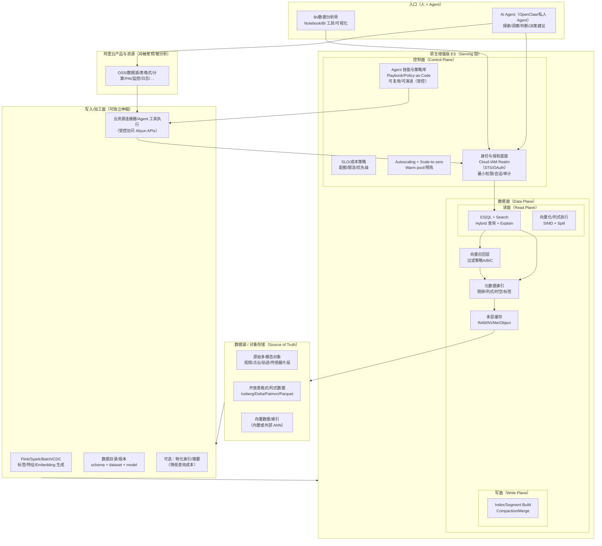
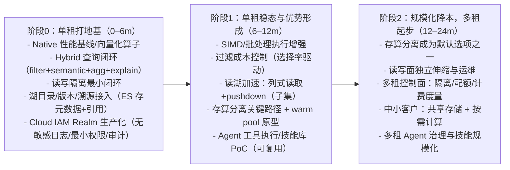

# 原生增强版 Elasticsearch：自动驾驶多模态数据“发现 + 分析”（未来 1–2 年）战略思考与计划

**时间范围**：未来 12–24 个月（以可交付、可验证为约束）  
**主战场**：自动驾驶 / 车联网（数百亿级多模态数据的搜索与探索）  
**主要用户**：BI/数据分析师（交互式探索、可解释发现）；终端用户高 QPS（低优先级，提前留接口）  
**核心数据**：向量（embedding/特征）、文本（语义标签/事件描述）、结构化（时空/车辆/版本/场景/质量/权限/溯源）  
**定位一句话**：把 ES 做成“**搜索原生的多模态湖仓 Serving 层**”，用 **Hybrid（向量+文本+结构化）** 驱动发现，用 **OLAP 级执行与治理** 支撑规模化落地。  
**Agent 入场券**：以 **Cloud IAM Realm** 作为统一身份与授权底座，使 **AI Agent（如 OpenClaw）** 能在“最小权限 + 可审计”的前提下探索阿里云资源并做搜索/发现/洞察/决策建议；没有这一层，ES 很难进入 Agent 生态竞争。

---

## 0. 你的 1–2 年关键主张（原文 + 解读）

> 1) native 化大幅提升性能（general purpose）  
> 2) 进军数据湖：自动驾驶、车联网争优势；具身智能、私人 agent 抢先机（主要 OLAP）  
> 3) 真正且完善的存算分离（scale to zero 降本+稳定性）、读写分离（稳定性），先单租（general purpose）  
> 4) 基于 3 的多租：中小客户降本（general purpose）

**解读为 4 条“战略主线”（可并行，但有先后依赖）：**

1. **Native 性能线（通用）**：把“交互式发现”的关键路径（过滤→召回→聚合→解释）做成确定性快、确定性稳。  
2. **数据湖线（自动驾驶优先）**：把“湖”变成 ES 的上游与扩展盘——ES 不再只吃写入数据，而能“就湖发现”。  
3. **单租架构线（通用、先做对）**：完善存算分离 + 读写分离，先保证稳定与成本模型闭环。  
4. **多租商业线（通用、后规模化）**：在单租架构稳定后上多租控制面与隔离，把成本优势释放给中小客户。
5. **Agent 授权与技能生态线（自动驾驶/云生态）**：用 Cloud IAM 打通“人/Agent → ES → 阿里云产品”的可信链路，并把操作经验沉淀为可复用、可演进的技能与策略（规模化的竞争杠杆）。

---

## 1. 自动驾驶场景的“发现”闭环：为什么 ES 有机会赢

自动驾驶分析师的高频工作流基本是：

1) **结构化切片**：时间/地域/车型/版本/天气/路况/质量/权限域  
2) **语义/相似召回**：找“相同场景”“相似问题”“相似轨迹/行为片段”  
3) **聚合与对比**：版本回归、路段热力、长尾异常、覆盖率、误检/漏检群组  
4) **解释与溯源**：为什么命中、贡献因素、回放到视频/点云/轨迹原始对象

ES 的优势在于：倒排/聚合/治理很强，但需要把向量与数据湖纳入同一闭环，形成“发现体验”护城河。

---

## 2. 北极星目标（12–24 个月）

### 2.1 产品目标（面向分析师）

- **一条查询表达完整探索**：`filter(结构化)` + `semantic(文本/向量)` + `rank` + `group by` + `explain` + `drilldown`。  
- **发现可解释、可复现**：同一查询在版本/数据更新下能复现或给出变化解释（版本/模型/数据集 lineage）。  
- **从“命中”到“回放”一跳到位**：结果可直接定位到湖中的原始对象（URI + offset + version）。

### 2.2 工程目标（面向规模与成本）

- **百亿级可用**：过滤场景下仍能稳定返回 top-k，延迟与成本可控。  
- **可伸缩、可降本**：存算分离 + 多层缓存 + autoscaling（含 scale-to-zero 的可行形态）。  
- **稳定优先**：读写分离把写入/compaction/merge 的扰动与查询隔离。

---

## 3. 目标架构（12–24 个月视角）

**关键点：**

- **存算分离**：数据最终落湖；Serving 层可“就湖读/加速”，并通过缓存与物化索引把成本压住。  
- **读写分离**：读面稳定服务分析师查询；写面负责 ingest/index/compaction，互不拖累。  
- **向量与过滤一体化**：向量召回必须与元数据过滤/权限裁剪强耦合，保证成本与正确性。  

---

### 3.1 架构演进路线图（“单租先行”→“多租起步”）

> 这张图强调“架构形态的演进”，与第 4 章的“功能/工程泳道”互补。

## 4. 架构演进路线图（0–24 个月）

> 目标是“每 3–6 个月一批可验证交付”，并用指标驱动取舍（而不是一次性大改）。

### 4.1 Roadmap（泳道图）

| 轨道 | 0–6 个月（打地基，单租可用） | 6–12 个月（形成优势，单租稳态） | 12–24 个月（规模化与降本，多租起步） |
|---|---|---|---|
| **Native 性能（通用）** | 性能剖析体系；关键算子向量化（过滤/聚合/表达式）；内存/GC/Spill 基线 | SIMD/批处理执行增强；热点算子 native 加速试点（可回退） | 大盘性能回归体系；稳定的 native 扩展框架（通用算子库） |
| **Hybrid 发现（自动驾驶优先）** | 统一查询表达（filter+semantic+agg+explain）；后过滤+自适应过采样 | 选择率驱动过采样；语义分面（semantic facets）雏形；解释字段标准化 | 部分过滤下推（向量侧/数据侧）；“发现→回放”产品闭环完善 |
| **数据湖（自动驾驶/车联网优先）** | 湖目录/版本/溯源接入；ES 只存可筛选元数据+引用；可控 drilldown | 读湖加速：列式读取 + predicate pushdown（子集）；缓存策略与预热 | 更深的“就湖发现”：增量刷新、物化索引自动化、成本可视化 |
| **存算分离（通用）** | 明确分层缓存模型；远端读路径与容错；单租成本/SLO 可观测 | 读面可弹性扩缩；scale-to-zero 原型（warm pool） | 存算分离进入默认架构选项；冷数据成本显著下降 |
| **读写分离（通用）** | 资源隔离/线程池/IO 隔离；写入扰动不影响读面 SLO | 写入/compaction 调度产品化；读面优先级与隔离强化 | 支持更彻底的“写面/读面”独立伸缩与运维 |
| **单租→多租（通用）** | 单租 reference architecture + runbook；权限/审计闭环 | 多租控制面最小闭环：租户隔离、配额、限流、计费度量 | 多租规模化：中小客户成本优势（共享存储+按需计算） |
| **Agent 授权与技能生态（Cloud IAM）** | Cloud IAM Realm 加固；STS/OAuth 一致性；审计与最小权限；Agent 身份接入规范 | Agent 工具执行网关/连接器 PoC；技能/策略（可复用）；权限收敛与风险控制 | 多租下 Agent 治理（配额/审计/策略）；技能规模化分发与迭代（受控自动改进） |

### 4.2 交付顺序（建议的依赖关系）

1) **先单租把存算/读写做对**（稳定与成本模型闭环）  
2) 同期推进 **Hybrid 发现体验**（自动驾驶的差异化）  
3) 多租放在 “单租稳定 + 控制面成熟” 之后，否则容易把复杂度摊到每个子系统导致全面失速

---

## 5. 关键设计决策（自动驾驶场景强相关，决定成败）

1. **对象粒度与主键标准化**：帧/片段/轨迹/事件/场景的层级与主键必须统一（否则 join/聚合/回放都会碎）。  
2. **版本维度一等公民**：软件版本/模型版本/地图版本/数据集版本要能做切片与对比，并支持 lineage。  
3. **时空是第一过滤维度**：geo+time 的索引/压缩/聚合要有明确 best practice（否则成本会爆）。  
4. **向量检索的过滤策略必须产品化**：默认用“后过滤 + 自适应过采样”，并给出上限、降级与解释。  
5. **Explain 与溯源标准**：每条命中返回“命中原因 + 溯源指针”，让分析师能把发现变成可行动证据。  
6. **Agent-ready 授权是前置门槛**：Cloud IAM Realm 统一承接人/Agent 身份（STS/OAuth），并为“连接器/工具执行”提供最小权限、审计与策略约束，否则很难进入 Agent 生态竞争。  

---

## 6. 风险与反模式（以及应对）

- **反模式：把 ES 做成通用全量湖仓扫描引擎**  
  - 应对：聚焦“发现”（Hybrid + 聚合 + 可解释 + 回放），用“物化索引/缓存/摘要”控制成本，而不是一开始追求全量 scan。  
- **反模式：scale-to-zero 追求极致但冷启动不可接受**  
  - 应对：用 warm pool/预热/分层缓存，把“省钱”与“交互延迟”做成可配置档位。  
- **反模式：多租过早**  
  - 应对：先把单租存算分离+读写分离做成稳定产品面，再把控制面抽象出来。  
- **反模式：native 化只做“快”，不做“可控/可回退”**  
  - 应对：native 加速必须具备回退路径、灰度开关、可观测与一致性验证；否则线上风险不可控。  
- **反模式：Agent 有能力但无边界（越权/误操作/不可审计）**  
  - 应对：以 Cloud IAM 为统一身份底座；工具执行走策略收敛（Policy-as-Code）；强审计、最小权限、速率/配额/审批（必要时）与可回放证据链。  

---

## 7. 评估：方向是否正确？是否可达成？

> 评分为“面向未来 1–2 年的可交付性”视角（10 分满分）。

| 维度 | 评分 | 依据（简述） |
|---|---:|---|
| **前景/方向性（Promising & right direction）** | 8.5/10 | 数据湖 + 多模态发现 + serverless/存算分离是行业主趋势，自动驾驶是高价值楔子市场 |
| **可达成性（1–2 年）** | 7/10 | 若按“单租先行、分阶段交付、指标驱动取舍”，核心闭环可落地；但“真正存算分离 + scale-to-zero”工程量大 |
| **风险可控性** | 6.5/10 | native/存算/多租都属于高复杂度方向；必须坚持“可回退、可观测、可灰度”的工程纪律 |

**提升可达成性的三条硬建议：**

1) 把每个大方向拆成 **可上线的最小闭环**（3–6 个月），并用基准/soak/成本度量作为硬门槛。  
2) 对“就湖发现”采用 **分层策略**：先目录/版本/引用 → 再子集列式读取 → 再物化与自动化。  
3) 多租从一开始就设计，但 **不急于大规模启用**：先把控制面/度量/隔离做成内部能力再外放。  

---

## 8. 补充：从“其它关键视角”增强计划完整性（容易被忽略，但很致命）

1. **数据治理与合规**：数据保留/删除、权限域（项目/客户/车队）、审计、脱敏、密钥与凭证生命周期。  
2. **数据质量与标注闭环**：质量维度必须可查询可聚合；支持“发现→抽样→回放→标注→再训练→再验证”的闭环指标。  
3. **BI 生态与易用性**：ES|QL 的可视化、notebook/BI 工具连接、可分享的探索资产（Saved query / dataset view）。  
4. **基准与对标**：不要只跑 TPC；要建立“自动驾驶发现基准”（过滤+向量+聚合+解释），并可复现。  
5. **SRE/运维产品化**：容量规划、缓存命中、对象存储读放大、热点保护、runbook、演练。  
6. **成本模型透明化**：每条查询的“对象存储 IO/网络/CPU/缓存命中”可见可归因，否则很难规模化。  
7. **Agent 安全与技能可规模化**：把“会用阿里云”的经验做成可分发技能（连接器/Playbook/策略），并建立受控的自动改进闭环（失败样本、回归测试、权限收敛）。  

---

## 9. 需要你确认的 7 个问题（回答后我可以把 roadmap 收敛成“可执行版本”）

1) 主要“发现对象”的粒度：帧/片段/轨迹/事件/场景 各自占比？典型 top-k 是多少？  
2) 过滤选择率大概什么量级（10%、1%、0.1%）？这决定过滤策略与成本上限。  
3) 时空查询占比：是否需要 road topology（道路/车道级维度）与热力聚合？  
4) 数据湖格式/治理：Iceberg/Delta/Paimon/自研？是否需要“就湖读”还是“离线写 ES”为主？  
5) 单租的 SLO 目标（p95/p99）与成本目标（每千次查询的对象存储读量/网络）？  
6) 多租隔离强度：软隔离够不够？是否需要严格 ABAC 与强审计合规？
7) Agent 范围与权限：Agent 需要操作哪些阿里云产品（只读发现/可写治理）？是否需要统一的工具执行网关与审批流？
